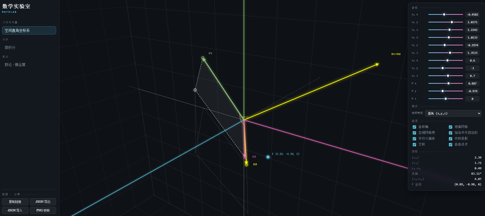
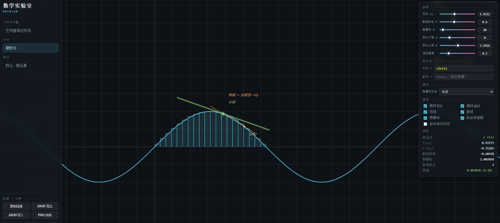
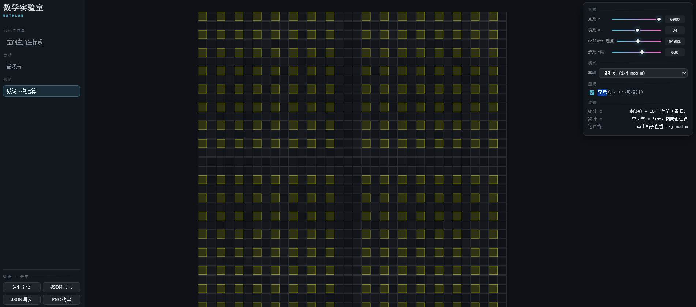

[English](README.md) | [简体中文](README.zh-CN.md)
# 数学实验室 · MathLab

[](LICENSE)
[]()
[]()

> 单文件、零构建依赖、**3Blue1Brown 风格**的数学可视化工作台。你可以在浏览器中亲手“把玩”数学。

## 💡 为什么做这个？

受 3Blue1Brown 视频启发，我希望将那种沉浸式的数学动画体验，变成**真正可交互的沙盒**。得益于单文件 HTML 的设计，你不需要配置 Node.js、不需要 Webpack，双击即可运行。借助断网降级策略（CDN 失败自动切换内置补间器与纯文本排版），它甚至能完全离线工作。

## ✨ 核心特性

- **零构建依赖**：核心代码纯原生 JS + Canvas，不依赖任何运行时 npm 包（GSAP 和 KaTeX 仅为可选优化，失效时可降级）。
- **主题即插即用**：严格遵循模块契约，新增一个数学主题只需新增一个 `.js` 文件，**无需修改任何 core 代码**。
- **极致安全**：内置表达式解析器，绝无 `eval` / `new Function`，严防注入攻击，并能优雅处理表达式语法错误与定义域错误。
- **完全可复现**：所有面板参数、视角、时间轴状态均支持编码进 URL，一键复制链接即可分享当前的数学发现。
- **3Bule1Brown 视觉还原**：暗色背景、青黄品红高光、优雅的衬线字体、平滑的 GSAP 补间动画。


## 🖼️ 视觉效果

**空间直角坐标系**（可拖拽的 3D 向量与平行六面体）：


**微积分**（割线趋近切线、黎曼和收敛）：


**数论 · 模运算**（素数螺旋与 Collatz 瀑布）：


## 🚀 快速开始

1. **本地开发**：双击 `src/index.html`（Chrome / Edge 支持从 `file://` 加载同目录经典脚本。Firefox 建议使用构建产物）。
2. **单文件构建**：运行 `node tools/build.mjs`，生成的 `dist/mathlab.html` 双击即用，可离线分发给任何人。
3. **断网测试**：拔掉网线刷新页面，功能依然可用，仅动画变生硬、公式降级为文本。

## 🧮 已内置主题

| 主题 | 内容 |
| --- | --- |
| **空间直角坐标系** | 3D 向量加法/内积投影/叉积/平行六面体；直角/柱/球三种坐标制式；拖动箭头端点（Shift = 相机平面全自由度）；双击地面放自由点 |
| **微积分** | 自写表达式解析器输入 f(x)/g(x)；割线→切线极限（h→0）；中心差分求导；五种黎曼和方法；误差随 N 的 log-log 收敛图；自动滚动切点 |
| **数论 · 模运算** | 素数螺旋（Ulam）、模乘表（乘法群/单位）、Collatz 对数瀑布（安全整数溢出保护） |

## ⌨️ 快捷键

| 按键 | 作用 |
| --- | --- |
| `空格` | 播放 / 暂停 |
| `←` / `→` | 后退 / 前进一帧 |
| 拖拽时间轴 | 实时 scrub 时间 |
| 滚轮 | 缩放视图 |
| 拖拽空白处 | 3D 中旋转视角；2D 中设置切点 |
| `Alt+拖拽` | 平移视图 |
| `Shift+拖拽端点` | 3D 中实现全自由度拖拽 |
| `?` | 显示帮助提示 |

## 🔗 URL 参数与开发者工具

- `?selftest=1`：运行内核自检（包括表达式解析器拒绝注入、4×4 矩阵求逆、3D 投影往返、数值微积分、筛法与 Collatz 边界测试）。
- `?stats=1`：显示实时帧时间（FPS）、图元统计数与降级状态指示。
- `#t=<topic>&s=<压缩状态>`：状态分享。点击面板的「复制链接」生成，打开该链接可直接还原你的工作区。

## 🧩 添加一个新主题（扩展指南）

这个工作台的精髓在于**core 与主题的解耦**。添加新主题**不需要修改 core 中任何一行代码**：

1. 在 `src/topics/` 下新建 `<name>.js`，注册 `LAB.topics.<name> = { meta, impl }`。
   - `meta` 负责声明 `defaults`（默认状态）、`schema`（UI 面板）、`timeline`（时间轴关键帧）。
   - `impl` 实现可选的生命周期：`init` / `onParam` / `onMode` / `onToggle` / `onField` / `onPointer` / `onKey` / `applyTime` / `render` / `serialize` / `deserialize` / `selftest`。
2. 在 `src/index.html` 的脚本区增加一行 `<script src="topics/<name>.js"></script>`。
3. 重新运行 `node tools/build.mjs` 即可。

## 📂 项目结构

```text
src/
  index.html            开发壳（样式、布局、脚本装配）
  core/                 框架（boot/util/tween/vec/expr/state/viewport/render/ui/shortcuts/hud/app）
  topics/               主题模块（coordinate3d / calculus / numbertheory）
  main.js               装配终点（置位 app.ready）
tools/build.mjs         拼接 → dist/mathlab.html